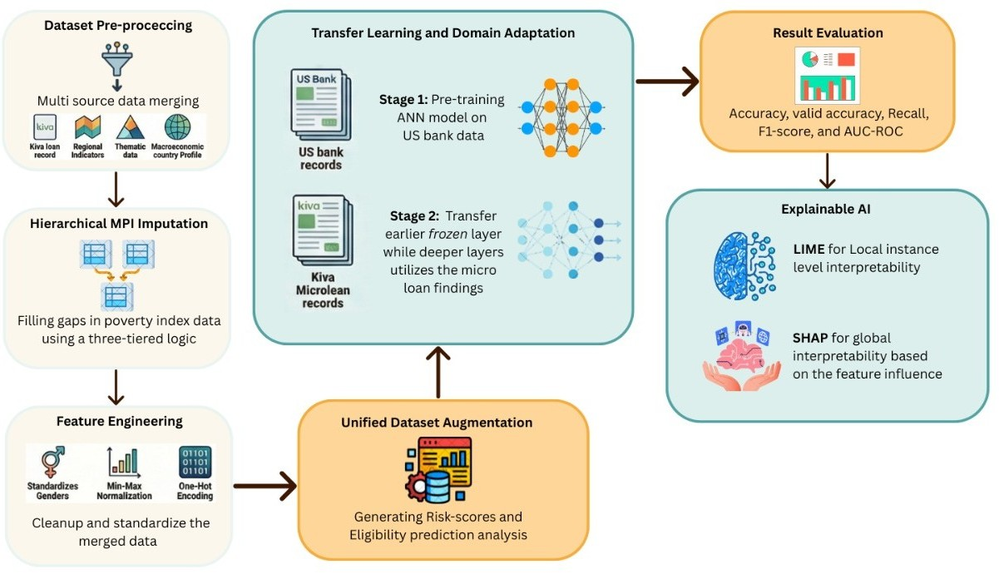

# Capstone Thesis: Augmenting Microloan Risk Modeling through Data Synthesis and Transfer Learning: Interpreted with LIME and SHAP

## Abstract
In emerging economies, financial exclusion driven by information asymmetry prevents millions from accessing formal credit. This research proposes a deep learning model using Transfer Learning that pretrains an ANN on a US bank loan dataset and transfers learned patterns to Kiva microloan data, combining financial and socioeconomic factors into a unified risk scoring framework. Explainable AI techniques such as SHAP and LIME are applied to ensure transparency and fairness.

## Methodology

## Key Results
- Validation Accuracy: 89.52% (Improvement: +4.28%)
- Overall Accuracy: 86.95% (Improvement: +4.63%)
- AUC: 0.90 (+0.06%)
- F1-Score: 0.86 (+0.05%)

## Conclusion
This research developed a three-step computational framework that bridges the gap between data-abundant banking systems and low-resource microfinance settings. The Transfer Learning model outperformed the baseline, and Explainable AI provided transparency.

For full details, refer to the PDF: [Capston-Thesis-48-era-Final.pdf](Capston-Thesis-48-era-Final.pdf)
